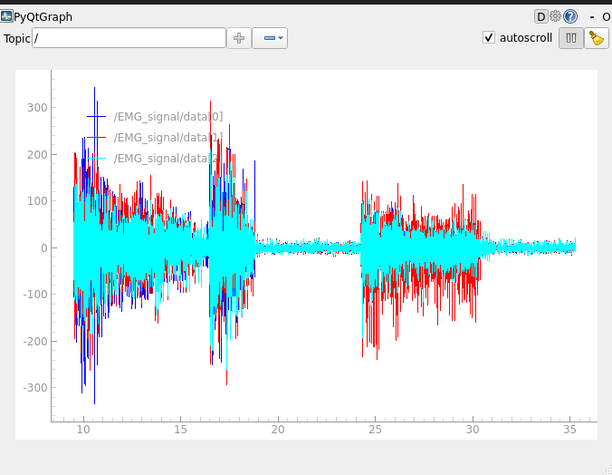
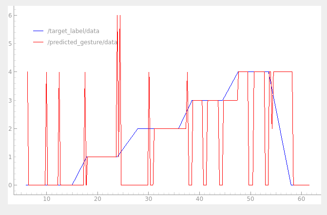
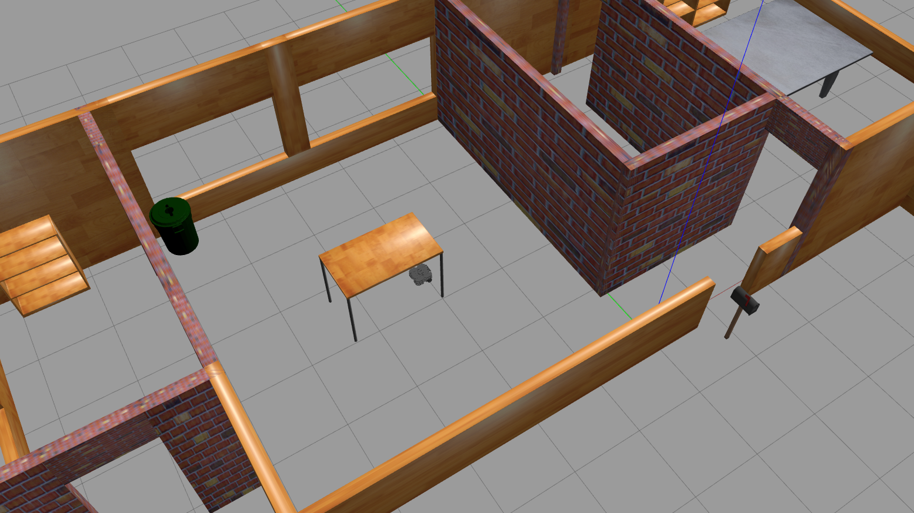

# # EMG Drive Control

System sterowania oparty na danych EMG (elektromiografia), służący do zdalnego kierowania urządzeniem (np. robotem typu differential drive) przy użyciu sygnałów mięśniowych. Projekt został zrealizowany w środowisku ROS 2 i Python.

## Opis działania

Repozytorium zawiera trzy główne komponenty:
- `emg_publisher`: publikuje dane o odpowiedniej etykiecie na odpowiedni temat ROS 2. Symuluje wykonywanie gestów
- `main`: odbiera dane EMG i dokonuje predykcji na bazie wcześniej wyuczonego modelu
- `gesture_to_cmd`: steruje ruchem obiektu (np. Turtlebota) na podstawie opublikowanej predykcji przez model

---

## Uruchomienie

Instalacja zależności (w obrębie workspace ROS 2):

```bash
source /opt/ros/humble/setup.bash
pip install -r requirements.txt
colcon build --symlink-install
source /install/setup.bash
```
Uruchomienie wszystkich węzłów
```bash
ros2 launch EMG_control gesture_pipeline.launch.py 
```

W celu zasymulowania gestu należy opublikować wiadomość typu INT32 w temacie /target_label np.:
```bash
ros2 topic pub /target_label std_msgs/Int32 "{data: 0}"
```

## Działanie

Po zasymulowaniu gestu publikowana zostaje losowa sekwencja z zadaną etykietą od początku do końca. W przypadku wysłania innej zadanej etykiety poprzednio publikowana sekwencja zostaje zastąpiona aktualną. W przypadku braku zadanej etykiety, po ukończeniu sekwencji program zaczyna zadawać stan 0 - szum.



Model nasłuchuje sygnału i dokonuje predykcji w czasie rzeczywistym, z opóznieniem wynoszącym 200[ms] - 1024 próbki, aby uzyskać dużą responsywność modelu.



Ostatni węzeł zajmuje się sterowaniem samym robotem, w naszym przypadku turtlebotem. Nasłuchuje on predykcji i publikuje odpowiednie komendy niezbędne do sterowania.



## Przyszły rozwój

Aby w przyszłości uruchomić program online na prawdziwym robocie lub na prawdziwych danych w czasie rzeczywistym z opaski nalezy zmienic odpowiednio węzeł wyjsciowy do sterowania odpowiednim robotem - gesture_to_cmd lub węzeł wejsciowy - emg_publisher, do działania w trybie online na danych w czasie rzeczywistym.
